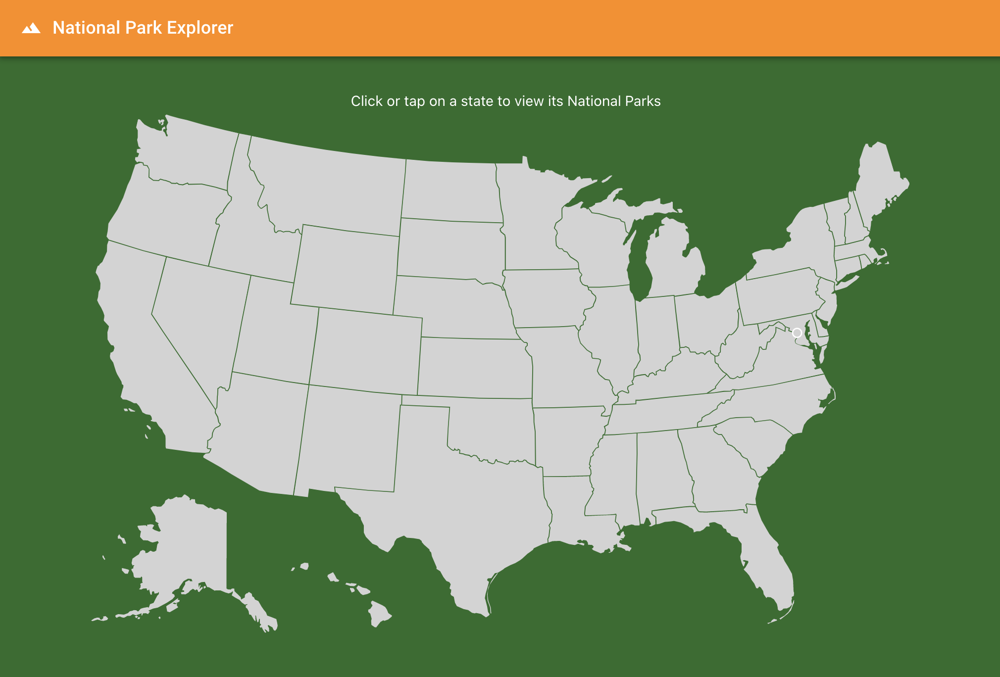

# National Park Explorer

Link: [National Park Explorer](https://national-park-explorer.vercel.app/)

The National Park Explorer is a React app that allows you to view each state's National Park sites.

The app was bootstrapped with the [Create React App](https://github.com/facebook/create-react-app) toolchain.

It consumes the official [National Park Service API](https://www.nps.gov/subjects/developer/get-started.htm).

The interactive map is a wonderful `npm` addition from [react-usa-map](https://www.npmjs.com/package/react-usa-map).

The UI utilizes several [Material-UI](https://material-ui.com/) components.

Visit the link at the top to check it out!

To run locally:

* Make sure you have Node installed
* Clone the repo
* Run `npm i` to install packages
* Run `npm run start` to start the local server
* Visit `localhost:3000` in your browser

&nbsp;

Designed and maintained by Brian Fitzgerald

Email: brianjfitzgerald@gmail.com

Copyright &#169; 2021
